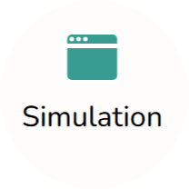
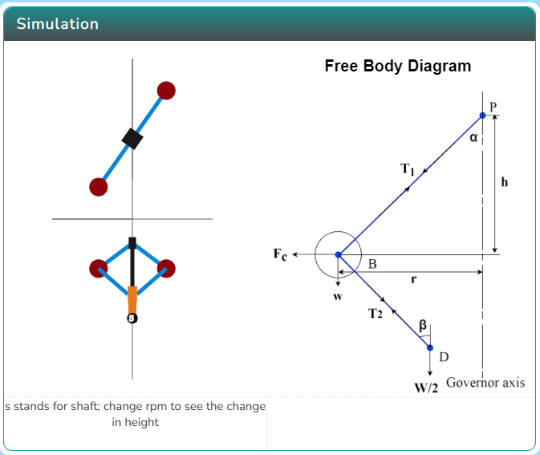
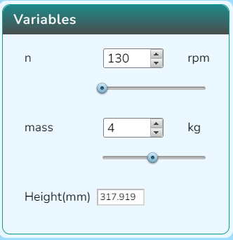
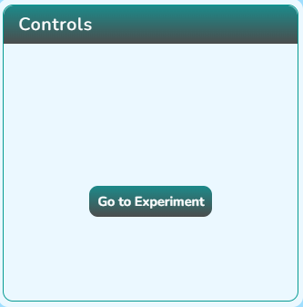
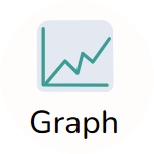
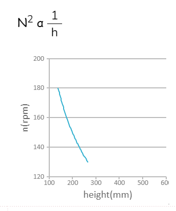

### Procedure

  Click on the Simulation icon      to view the simulation screen. 

   
   
   In order to view the variable section click on the Variable icon .

   

To view the control section, click on the Controls icon .

   

Click on the Graph icon  to view the graph.

Click on the "Go to Experiment" button in the control section.

   
  
  Choose one of the experiment and then click on the "Start Experiment" button in the control section to proceed with it. 
    

 Click on the "Go to simulator" button  to view the simulator again. 
  
 

