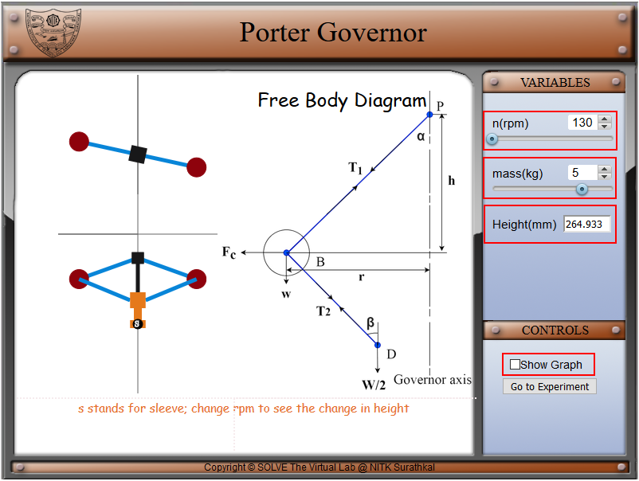
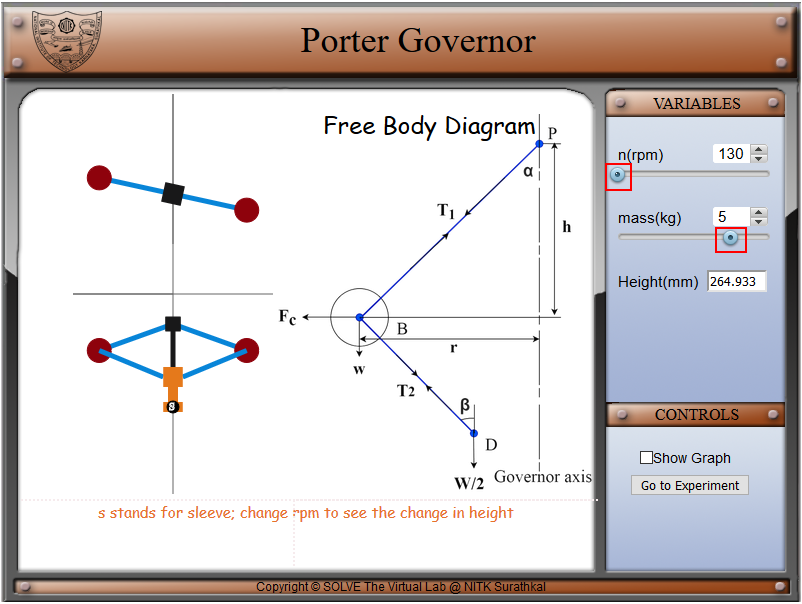
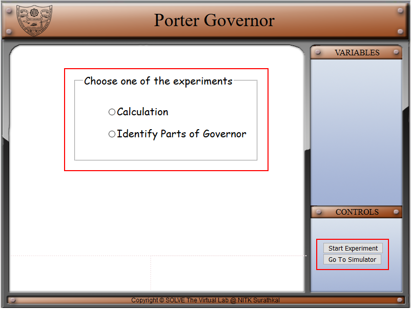
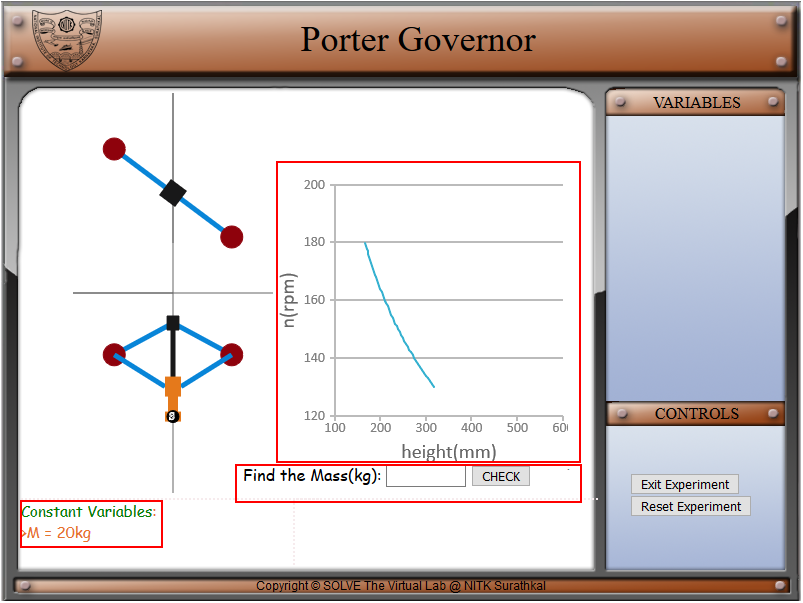

#### These procedure steps will be followed on the simulator

1. In simulation window front, top view and free-body diagram of Porter governor is displayed. 

2. Speed, mass and height control sliders are given in variables tab. The controls tab provides a checkbox **Show Graph** to display the graph. 
    

3. Move the slider knob to the right, under the rpm and mass to see the change in the animation of the porter governor, the rpm can change from 130 to 180 rpm and mass can be changed from 2 to 6 kg. 
    

4. When **Show Graph** checkbox is checked, a graph and theoretical correlation is displayed. This graph shows the trend of governor height on varying the rotational speed of governor.  
    

5. For the experiments select **Go to Experiment** in the control panel. 
    

6. On the experiment page of the simulator, the user can choose between calculating and identifying the parts of the porter governor. The control panel can be used to start the experiment or to go back to the simulator. 
    

7. In the calculation experiment, constant variables, height and mass graphis given for the calculation of the mass, user can verify their mass from the check box. User can use the **Reset Experiment** option in the control panel to reset the experiment for new calculation. For going back to choose the experiment **Exit Experiment** button can be used in control panel. 
    

8. In the identify parts of the governor experiment, a porter governor setup in the middle of the simulation screen, different parts of the governor have the dropdown box where user can choose the part name and verify the same. 
    
